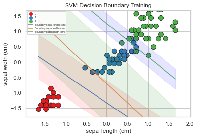
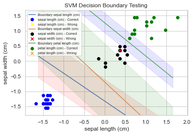

# Iris Flower Classification

This project is part of a series of 100 machine learning projects aimed at building and deploying machine learning models. 
The goal of this project is to classify different species of iris flowers based on the measurements of their petals and sepals.
You can test the swagger at : https://iris-classification-service-697664343307.europe-west4.run.app/docs
# True Goal
The goal is not the model, it's all the rest : 
clear project structure, consistent naming, documentation of functions and project,
introduction to fast api, dockerization and glood run deployment.
Clearly it's not a showcase of theoriticall DS skills but we made sure to review the concepts of:
cross eval, decision boundary, bias-variance tradeoff etc.
## Table of Contents
1. [Introduction](#introduction)
2. [Dataset](#dataset)
3. [Installation](#installation)
4. [Model Prototyping](#Model-Prototyping)
5. [Usage](#usage)
6. [Model Performance](#model-performance)
7. [Results](#results)
8. [Conclusions](#conclusions)
9. [Deploy Model](#deploy-model)
10. [Project Structure](#project-structure)

## Introduction

The Iris dataset is a classic dataset in machine learning. 
It consists of 150 samples of iris flowers, with three different species: Setosa, Versicolor, and Virginica. 
Each sample is characterized by four features: sepal length, sepal width, petal length, and petal width. 
The objective of this project is to build a classification model that can predict the species of an iris flower based on these features.

## Dataset

The dataset used in this project is the Iris dataset, which is included in the 'sklearn.datasets' module. 
The dataset consists of 150 samples with 4 features and 1 target variable (species).

- **Features**: Sepal length, Sepal width, Petal length, Petal width
- **Target Variable**: Species (Setosa, Versicolor, Virginica)

## Installation

To run this project, you'll need to install the required dependencies. You can install them using the following command:

'''bash'''
pip install -r requirements.txt

#### **Model Prototyping**

## Model prototyping
In scripts/ModelPrototyping.py you can see that we applied our preprocessing and tested 3 models.
LinearRegression and RandomForest that had 100% accuracy and SVM that had 95%
We decided to continue with it to have some interesting descision boundary plots and practice that.

#### **Model Performance**

## Model Performance

The model was evaluated using cross-validation and achieved the following metrics:

- **Accuracy**: 97%
- **Precision**: 98%
- **Recall**: 97%
- **F1-Score**: 98%

## Results

The model successfully classifies iris flowers with high accuracy. 
The confusion matrix shows that the model performs well across all three classes, with very few misclassifications.

## Conclusions

The classification model performs well on the Iris dataset, demonstrating the effectiveness of basic machine learning techniques on a well-structured dataset. 
This project serves as a solid foundation for more complex classification problems.

## Deploy Model
### FastAPI
in application/app.py we've built a fast api service to predict classes and render probabilities
To run in the "application" folder 
'''bash
uvicorn app:fastapp --reload

### Docker
We've then created a docker image (see Dockerfile) at the root of this project
to build and run the docker image : run at the root of the project
'''bash

docker build -t my-fast-api-app .
docker run -d -p 8000:8000 my-fast-api-app
check errors : docker ps -a
docker logs <logs>

### GitHub Container Repository
SET GHCR
1. Go to GitHub PAT Settings.
2. Click on Generate new token.
3. Select the necessary scopes:
    * write:packages
    * read:packages
    * delete:packages
4. Generate and copy the token.
'''bash
docker login ghcr.io -u aboulo1
Paste token as password
'''bash
docker tag my-fast-api-app ghcr.io/aboulo1/my-fast-api-app:latest
docker push ghcr.io/aboulo1/my-fast-api-app:latest
You can pull it from the link below in GHCR
https://github.com/users/aboulo1/packages/container/package/my-fast-api-app

### Google Cloud Run
https://cloud.google.com/run/docs/configuring/services/containers?hl=fr#gcloud_1
https://medium.com/@saverio3107/deploy-fastapi-with-docker-cloud-run-a-step-by-step-guide-a01c42df0fee
The deployment failed after a lot of attempts due to app failing to listen to port 8000 or 8080
'''bash
make buildgcr
### Deploy it 
''' bash
make push_gcr
make deploy_gcr

## Project Structure

The project is organized into the following structure:

### Explanation:
- **`data/`**: Directory to store dataset files.
- **`notebooks/`**: Contains Jupyter notebooks for Exploratory Data Analysis (EDA) and other prototyping tasks. Includes a notebook 'Fundamentals.ipynb' where theoretical answers are documented.
- **`scripts/`**: Python scripts used for data processing, model training, and evaluation.
- **`models/`**: Directory where serialized models (like '.pkl' or '.h5' files) are stored after training.
- **`app/`**: Directory for application code, such as a Flask or FastAPI app, used to deploy the model.
- **`README.md`**: The main project documentation, providing an overview and instructions.
- **`requirements.txt`**: Lists all the dependencies required to run the project.
- ** 'Dockerfile' ** : The dockerfile to create the image of our application to deploy on GCP